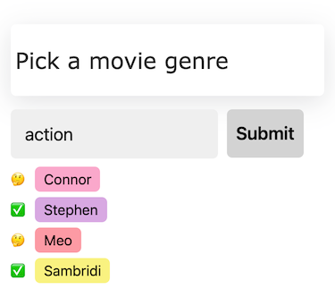

# How to Play

## 1. Fill in the blank

## 2. Get your neighbor's script, fill in the next blank

## 3. Enjoy the chaos

## 4. Vote for best

# Development
## Deploy
git push heroku main
heroku run rake db:migrate

## Smoke Test
heroku logs --tail
heroku open

## Debugging
heroku run rails console

## Monitoring
Game.last(10).each { |game| puts "#{game.token} - #{game.users.map(&:name).join(", ")}" };nil